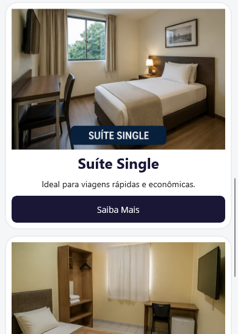
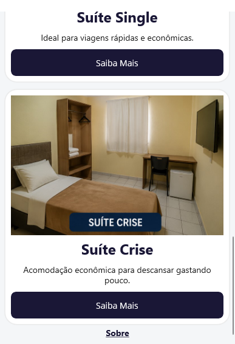
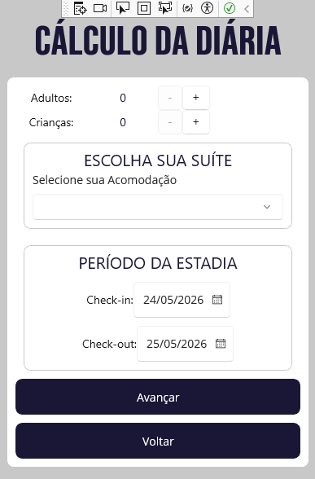
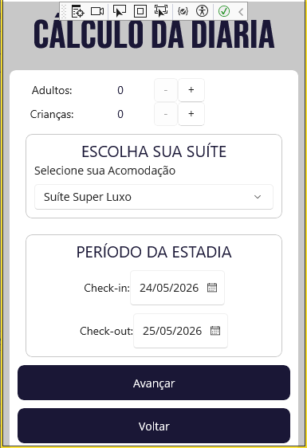
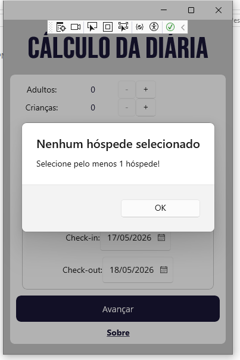
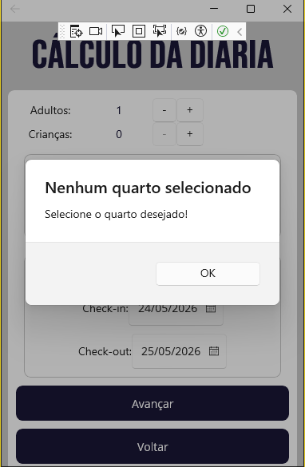
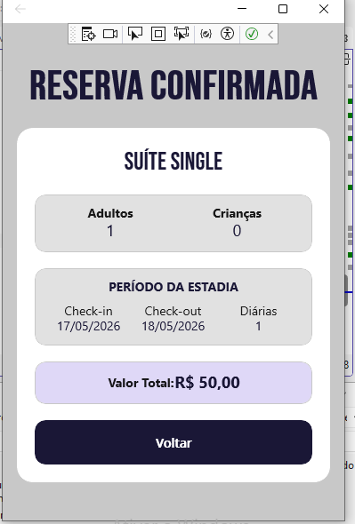
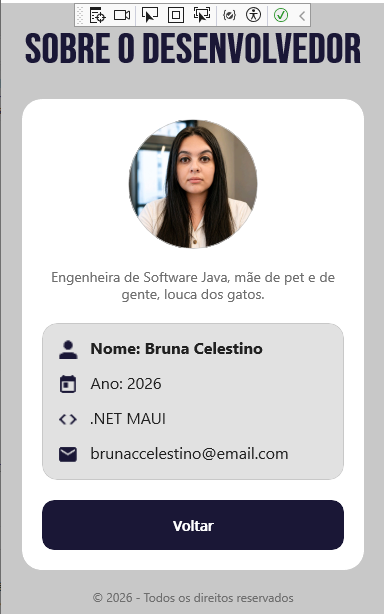

# MauiAppHotel

Projeto desenvolvido em **.NET MAUI** como atividade prática para criação de interfaces mobile.

## Objetivo da atividade

Após codificar todo o projeto, execute alterações em seu design, como alteração de cores, inserção de telas e outros recursos de sua escolha.

## Personalizações realizadas

Durante o desenvolvimento, foram realizadas melhorias visuais e funcionais:

- Personalização de cores utilizando `Colors.xaml`;
- Uso de fonte customizada `BebasNeue`;
- Reformulação completa do layout para visual mais moderno;
- Padronização visual entre todas as telas;
- Criação da tela **Sobre o Desenvolvedor**;
- Criação de **Página Inicial**;
- Criação de **Página Detalhes do Quarto**;
- Ao acessar a página de detalhes de um quarto e então clicar em "Contratar Hospedagem", o seletor de suíte é pré-carregado com o nome do quarto que o usuário estava visualizando.
- Adição de foto do desenvolvedor em formato circular;
- Inclusão de informações como nome, ano de desenvolvimento, tecnologia e contato;
- Implementação de validações antes da confirmação da hospedagem.

## Validações implementadas

Foram adicionadas validações para melhorar a experiência do usuário e evitar falhas na aplicação:

- Exibição de mensagem caso nenhuma quantidade de hóspedes seja selecionada;
- Exibição de mensagem caso nenhuma suíte seja escolhida;
- Bloqueio do avanço enquanto informações obrigatórias não forem preenchidas;
- Prevenção de erros de execução, como `NullPointerException` ao tentar acessar dados não selecionados.

## Funcionalidades

O aplicativo permite:

- Ver todas as suítes;
- Ver detalhes da suíte escolhida;
- Selecionar quantidade de adultos e crianças;
- Escolher suíte;
- Selecionar período de hospedagem;
- Calcular valor total da diária;
- Visualizar confirmação da reserva;
- Acessar tela de informações do desenvolvedor.

## Capturas de tela

### 1) Tela inicial

### 2) Detalhe do quarto

### 3) Cálculo da diária (click a partir da Página Inicial)

### 4) Cálculo da diária (click a partir de Detalhe do Quarto)

### 5) Validações antes da confirmação

### 6) Reserva confirmada

### 7) Tela Sobre

## Tecnologias utilizadas

- .NET MAUI
- C#
- XAML

## Desenvolvedora

**Bruna Celestino**  
Engenheira de Software Java  
Ano de desenvolvimento: **2026**